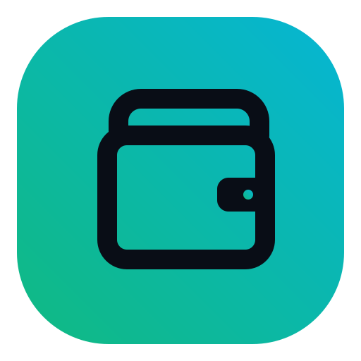
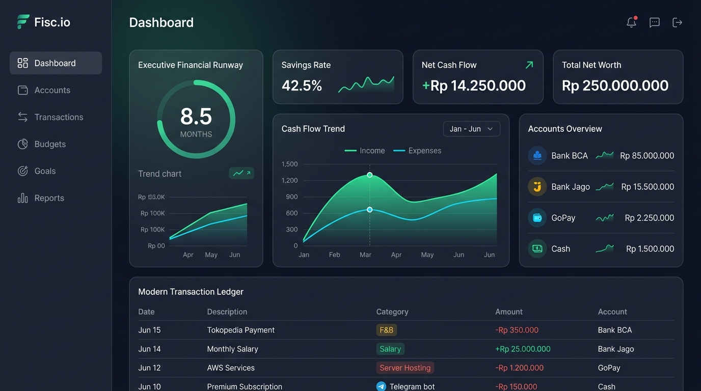
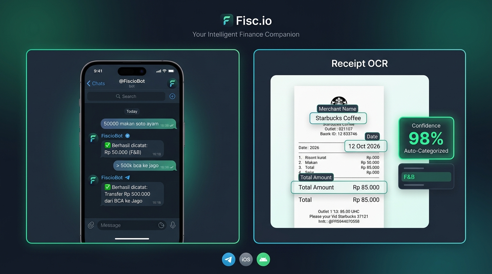
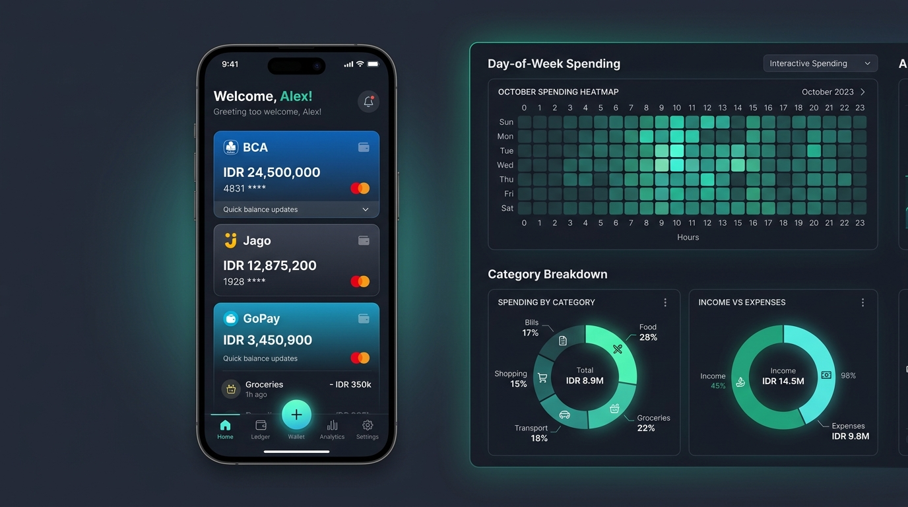
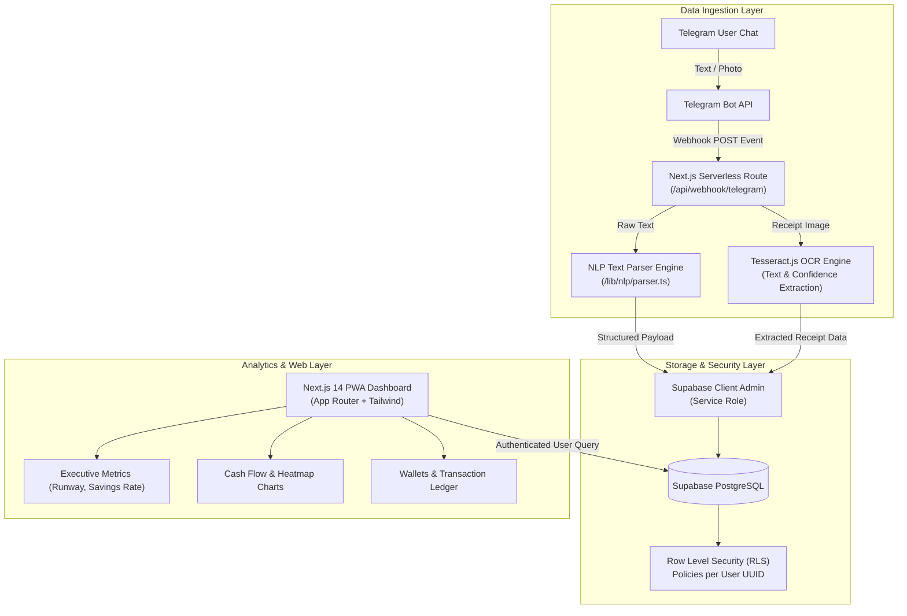

<div align="center">

  

  # Fisc.io
  ### Smart Omnichannel Cash Flow & Wealth Analytics Platform

  <p align="center">
    <b>Pencatatan keuangan tanpa friksi via Telegram Bot (NLP & OCR) dipadukan dengan Executive Analytics Dashboard berbasis Next.js PWA.</b>
  </p>

  <p align="center">
    <a href="https://fisc.farlabs.my.id" target="_blank">
      
    </a>
    <a href="https://t.me/FiscioBot" target="_blank">
      
    </a>
  </p>

  <p align="center">
    
    
    
    
    
    
  </p>

</div>

---

## 📌 Sekilas Tentang Project (Executive Summary)

Kebanyakan aplikasi pelacak keuangan (*expense tracker*) gagal dipertahankan penggunanya karena memiliki **friksi entri data yang tinggi** (harus membuka aplikasi, login, mengisi dropdown form berlapis-lapis setiap kali membeli secangkir kopi).

**Fisc.io** memecahkan masalah ini dengan paradigma arsitektur **Dual-Interface**:
1. **Ingestion Layer (Telegram Bot)**: Pengguna mencatat transaksi dalam **< 3 detik** langsung dari ruang chat menggunakan bahasa natural (*Natural Language Processing*) atau cukup memotret struk fisik (*Receipt OCR*).
2. **Analytics Layer (Next.js PWA Dashboard)**: Saat ingin mengevaluasi kesehatan finansial, pengguna mengakses *dashboard* analitik eksekutif dengan metrik strategis seperti *Financial Runway*, *Savings Rate*, *Cash Flow Trend*, dan *Spending Heatmap*.

---

## 📸 Preview Antarmuka (Application Showcase)

### 1. Executive Analytics Dashboard (Desktop View)
*Bento-grid layout modern dengan dark mode, visualisasi grafik interaktif, indikator runway keuangan, dan pemantauan saldo multi-rekening.*

<div align="center">
  
</div>

<br />

### 2. Telegram Bot Ingestion & Receipt OCR Pipeline
*Catat transaksi via chat instan, transfer antar-rekening otomatis, dan ekstraksi struk belanja menggunakan Optical Character Recognition (OCR).*

<div align="center">
  
</div>

<br />

### 3. Mobile PWA Experience & Deep Analytics
*Tampilan responsif mobile-first dengan 5-Tab Bottom Navigation, Floating Action Button (FAB), Day-of-Week Spending Heatmap, dan manajemen dompet digital.*

<div align="center">
  
</div>

---

## 🚀 Fitur Unggulan (Core Features)

### 💬 1. Zero-Friction Telegram Bot Logging
* **Natural Language Text Parsing**: Engine regex NLP cerdas yang mengenali nominal, keterangan, dan kategori secara otomatis:
  * `50000 makan siang soto ayam` ➜ Otomatis dicatat sebagai **Pengeluaran** kategori *F&B*.
  * `+8000000 gaji bulanan` ➜ Dicatat sebagai **Pemasukan** kategori *Salary*.
  * `> 500k bca ke jago` ➜ Dicatat sebagai **Transfer** (mengurangi saldo BCA & menambah saldo Jago secara atomik).
  * Dukungan shorthand Indonesia: `25k` (ribu), `1.5jt` (juta).
* **Smart Receipt OCR**: Foto struk belanjaan ➜ sistem mengekstrak *Merchant*, *Total Nominal*, dan *Tanggal Transaksi* serta menyematkan *Confidence Score*.
* **1-Click Deep Linking**: Integrasi aman akun web ke bot Telegram via tombol *One-Click Link* atau perintah `/link <user_id>`.

### 📊 2. Executive Financial Analytics
* **Financial Runway Tracker**: Menghitung estimasi ketahanan dana darurat Anda dalam hitungan bulan berdasarkan *Liquid Cash* dibagi *Average Monthly Burn Rate*.
* **Savings Rate Indicator**: Persentase rasio tabungan & investasi terhadap total penghasilan bersih bulanan.
* **Net Cash Flow & Dynamic Trend**: Visualisasi komparasi pemasukan vs pengeluaran berbasis grafik dinamis Recharts.
* **Day-of-Week Spending Heatmap**: Matriks intensitas pengeluaran berdasarkan hari dalam seminggu untuk mendeteksi kebiasaan boros (misal: lonjakan *weekend spending*).

### 💳 3. Multi-Account & Wallet Management
* Kelola berbagai jenis akun keuangan dalam satu layar: **Bank Transfer** (BCA, Mandiri, Jago), **E-Wallet** (GoPay, OVO, ShopeePay), **Cash**, dan **Investment**.
* Perhitungan saldo real-time yang tersinkronisasi otomatis saat transaksi dicatat melalui bot maupun web.

### 📑 4. Transaction Ledger & Audit Tools
* **Filter & Pencarian**: Filter cepat berdasarkan tipe transaksi (`Semua`, `Pengeluaran`, `Pemasukan`, `Transfer`).
* **OCR Confidence Badging**: Badge status verifikasi pada transaksi hasil scan OCR untuk mempermudah audit mandiri.
* **CRUD Transaksi Lengkap**: Tambah, ubah kategori, atau hapus transaksi secara manual melalui modal interaktif.
* **CSV Data Export**: Unduh seluruh riwayat pembukuan ke format file `.csv` untuk keperluan laporan pajak atau analisis lanjutan di spreadsheet.

### 📱 5. Progressive Web App (PWA)
* Dapat di-install langsung ke homescreen iOS / Android tanpa melalui App Store (*Add to Home Screen*).
* Dilengkapi Web App Manifest, icon adaptif, dan navigasi ergonomis jempol (*Thumb-Zone Friendly*).

---

## 🏗️ Arsitektur Sistem (System Architecture)



---

## ⌨️ Panduan Format Chat Telegram (@FiscioBot)

Bot mengenali format penulisan fleksibel sehari-hari:

| Tipe Transaksi | Contoh Perintah Chat | Hasil / Efek Sistem |
| :--- | :--- | :--- |
| **Pengeluaran** | `45000 nasi padang rendang` | Catat Expense: Rp45.000 (F&B) |
| **Pengeluaran (K)** | `28k kopi kenangan` | Catat Expense: Rp28.000 (F&B) |
| **Pemasukan (+)** | `+7500000 gaji pt maju jaya` | Catat Income: Rp7.500.000 (Salary) |
| **Pemasukan (Jt)** | `+1.5jt freelance landing page` | Catat Income: Rp1.500.000 |
| **Transfer (>)** | `> 500k bca ke jago tabungan` | Kurangi BCA Rp500rb, Tambah Jago Rp500rb |
| **Scan Struk** | *(Upload foto struk belanja)* | Ekstrak total, nama toko, & tanggal transaksi |
| **Hubungkan Akun** | `/link <user_uuid>` | Sinkronisasi chat Telegram dengan profil web |

---

## 🛠️ Tech Stack & Keputusan Rekayasa

| Layer | Teknologi | Alasan Pemilihan & Keunggulan |
| :--- | :--- | :--- |
| **Frontend Framework** | **Next.js 14 (App Router)** | Rendering hibrida (SSR + Client Components), integrasi API Route serverless tanpa backend terpisah. |
| **Bahasa Pemrograman** | **TypeScript 5** | *Type safety* penuh dari skema basis data Supabase hingga *payload* webhook Telegram. |
| **Styling & Design** | **Tailwind CSS + Glassmorphism** | Desain bertema gelap elegan (*fintech dark theme*), komponen adaptif, dan bento-grid modular. |
| **Visualisasi Data** | **Recharts + Custom SVG Heatmap** | Grafik *area chart* dan matriks *heatmap* performan tinggi tanpa membebani ukuran bundle aplikasi. |
| **Database & Auth** | **Supabase (PostgreSQL)** | Skema relasional yang tangguh, sistem autentikasi modern, dan keamanan tingkat baris (**RLS**). |
| **Data Extraction** | **Tesseract.js** | Library OCR berbasis WebAssembly untuk ekstraksi teks dari gambar struk secara asinkron. |
| **Deployment & Hosting** | **Vercel Serverless Edge** | Skalabilitas instan, *zero server maintenance*, serta *zero operational cost* (100% free-tier architecture). |

---

## 🗄️ Skema Database (Supabase PostgreSQL)

* **`users` (Supabase Auth)**: Mengelola identitas pengguna, sesi login, dan otentikasi Google OAuth.
* **`categories`**:
  * `id` (UUID), `user_id` (FK), `name` (Text), `type` (ENUM: `INCOME`, `EXPENSE`, `TRANSFER`).
* **`accounts`**:
  * `id` (UUID), `user_id` (FK), `name` (Text), `type` (`bank`, `ewallet`, `cash`, `investment`), `balance` (Numeric).
* **`transactions`**:
  * `id` (UUID), `user_id` (FK), `account_id` (FK), `type` (ENUM), `amount` (Numeric), `date` (Timestamp), `description` (Text), `category_id` (FK), `source` (`telegram_text`, `telegram_ocr`, `web_manual`), `confidence_score` (Float).
* **`telegram_links`**:
  * `user_id` (UUID, FK), `telegram_chat_id` (BigInt, Unique), `linked_at` (Timestamp).

---

## 💻 Panduan Instalasi Lokal (Local Development)

### 1. Clone Repository
```bash
git clone https://github.com/Frey210/Fisc.io.git
cd Fisc.io
```

### 2. Install Dependencies
```bash
npm install
```

### 3. Konfigurasi Environment Variables
Salin template konfigurasi lingkungan:
```bash
cp .env.example .env.local
```

Buka [.env.local](file:///.env.local) dan isi variabel berikut:
```env
# Supabase Configuration
NEXT_PUBLIC_SUPABASE_URL=https://your-project-id.supabase.co
NEXT_PUBLIC_SUPABASE_ANON_KEY=your-anon-key
SUPABASE_SERVICE_ROLE_KEY=your-service-role-key

# Telegram Bot Configuration
TELEGRAM_BOT_TOKEN=your-telegram-bot-token
TELEGRAM_WEBHOOK_SECRET=your-random-webhook-secret-string

# App Base URL
NEXT_PUBLIC_APP_URL=http://localhost:3000
```

### 4. Menjalankan Database Migration
Jalankan script migrasi yang ada di folder `supabase/migrations/` pada SQL Editor dashboard Supabase Anda untuk membuat tabel, relasi, dan fungsi RLS.

### 5. Jalankan Development Server
```bash
npm run dev
```
Buka browser di `http://localhost:3000`.

### 6. Menghubungkan Webhook Telegram (Local Testing)
Untuk menguji webhook Telegram secara lokal, gunakan tunneling melalui **ngrok**:
```bash
ngrok http 3000
```
Lalu set webhook bot ke URL ngrok Anda:
```bash
curl -F "url=https://your-ngrok-url.ngrok-free.app/api/webhook/telegram" \
     -F "secret_token=your-random-webhook-secret-string" \
     https://api.telegram.org/bot<YOUR_BOT_TOKEN>/setWebhook
```

---

## 🔒 Praktik Keamanan (Security Highlights)

* **Row Level Security (RLS)**: Setiap query ke tabel transaksi dan akun diverifikasi di level database PostgreSQL. Pengguna hanya dapat mengakses data miliknya sendiri (`auth.uid() = user_id`).
* **Admin Client Isolation**: `SUPABASE_SERVICE_ROLE_KEY` hanya diakses secara terisolasi di sisi serverless endpoint webhook Telegram dan tidak pernah terekspos ke sisi klien.
* **Webhook Secret Validation**: Webhook memeriksa header `X-Telegram-Bot-Api-Secret-Token` untuk mencegah serangan spoofing dari request liar.
* **Separation of Secrets**: Repositori menggunakan file template [.env.example](file:///.env.example) yang terproteksi dan menjaga kredensial lokal tetap diabaikan oleh Git.

---

## 👨‍💻 Author & Portofolio

**Fariz Achmad Faizal**
* **Portfolio & Live App:** [fisc.farlabs.my.id](https://fisc.farlabs.my.id)
* **GitHub:** [@Frey210](https://github.com/Frey210)
* **Telegram Bot:** [@FiscioBot](https://t.me/FiscioBot)

---

## 📄 Lisensi
Project ini didistribusikan di bawah lisensi [MIT License](LICENSE).
